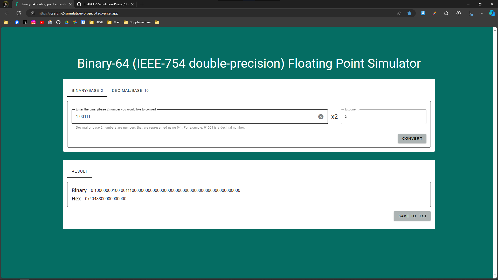
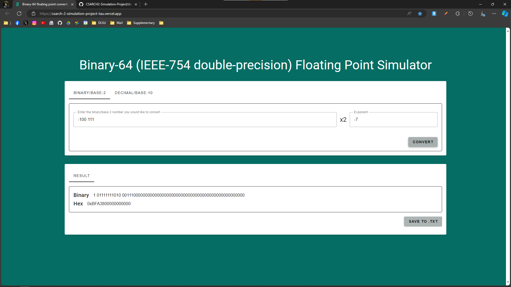
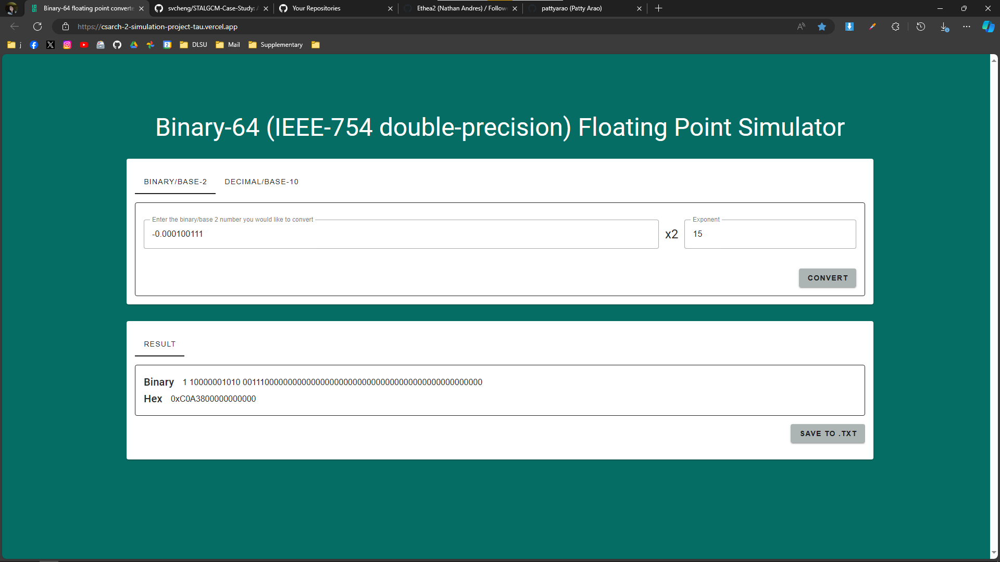
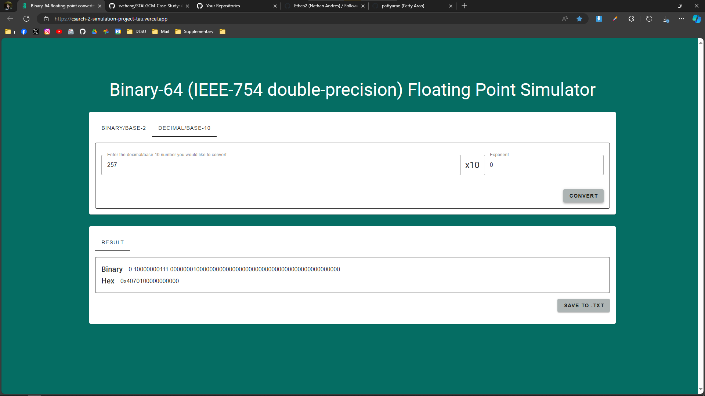
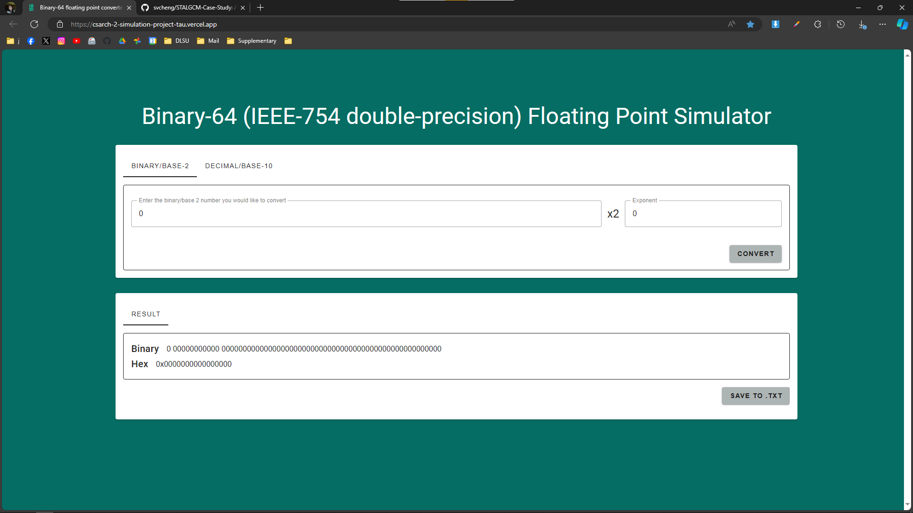
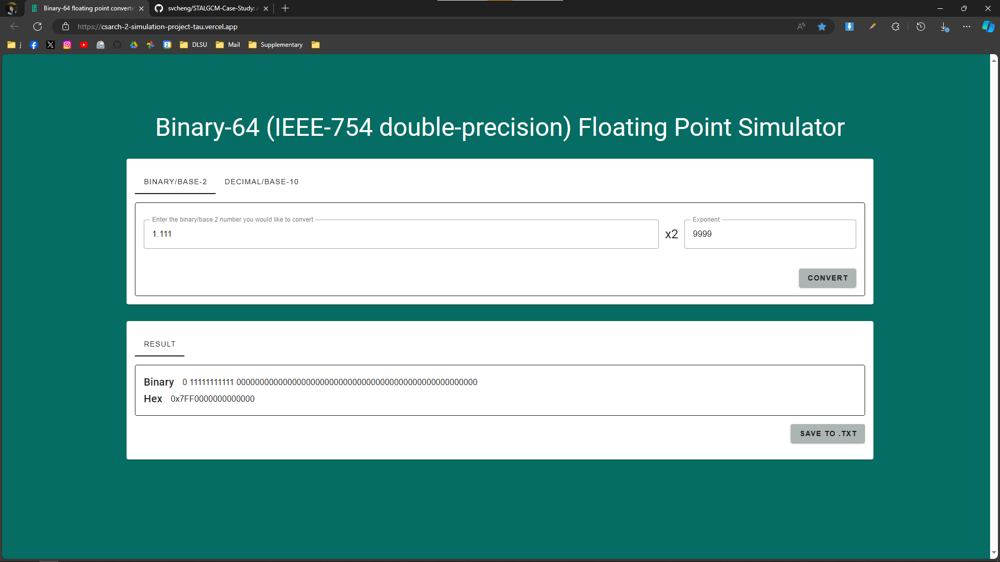
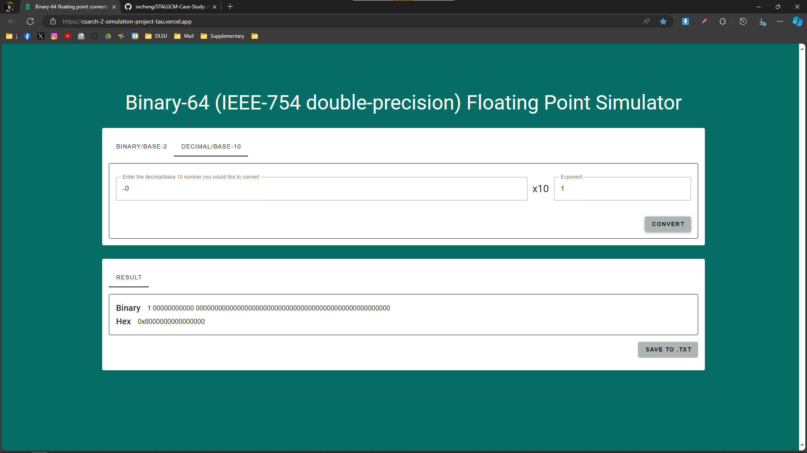
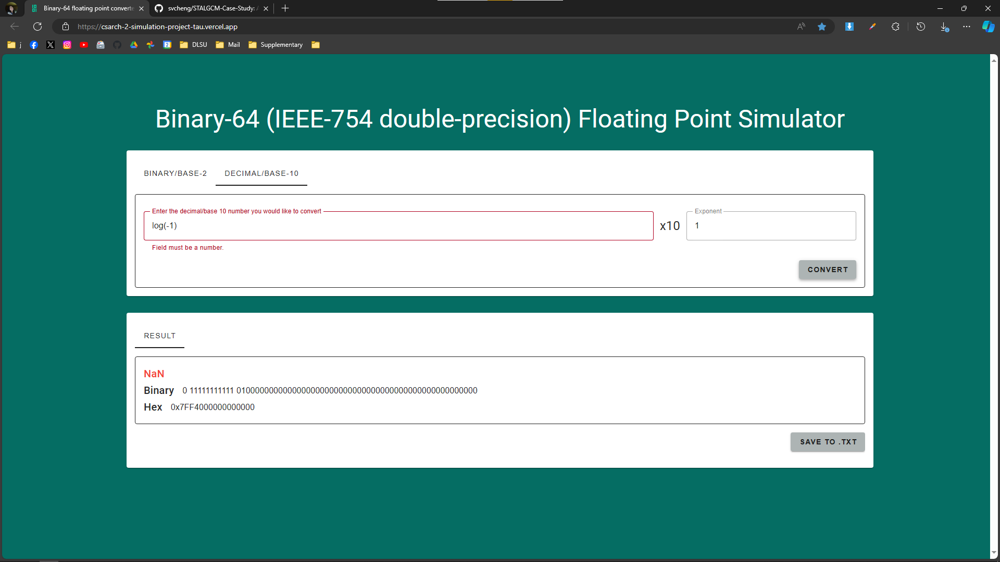

# Test Cases

## Normal Cases
### Binary

| Input               | Expected Binary                                                                 | Expected Hex       |
| ------------------- | ------------------------------------------------------------------------------- | ------------------ |
| +1.00111 x 2^5      | 0011 1000 0000 0000 0000 0000 0000 0000 0000 0000 0000 0000 0000 0000 0000 0000 | 0x4043800000000000 |
| -100.111 x 2^-7     | 1011 1111 1010 0011 1000 0000 0000 0000 0000 0000 0000 0000 0000 0000 0000 0000 | 0xBFA3800000000000 |
| -0.000100111 x 2^15 | 1100 0000 1010 0011 1000 0000 0000 0000 0000 0000 0000 0000 0000 0000 0000 0000 | 0xC0A3800000000000 |

### Decimal

| Input          | Expected Binary                                                                 | Expected Hex          |
| -------------- | ------------------------------------------------------------------------------- | --------------------- |
| 257.0 x 10^0   | 0100 0000 0111 0000 0001 0000 0000 0000 0000 0000 0000 0000 0000 0000 0000 0000 | 0x4070_1000_0000_0000 |
| 102.5 x 10 ^-1 | 0100 0000 0010 0100 1000 0000 0000 0000 0000 0000 0000 0000 0000 0000 0000 0000 | 0x4024_8000_0000_0000 |

## Special Cases
### Binary

| Case         | Input             | Expected Binary                                                                 | Expected Hex       |
| ------------ | ----------------- | ------------------------------------------------------------------------------- | ------------------ |
| Zero         | 0                 | 0000 0000 0000 0000 0000 0000 0000 0000 0000 0000 0000 0000 0000 0000 0000 0000 | 0x0000000000000000 |
| Denormalized | -1.1110 x 2^-1026 | 1000 0000 0000 0001 1110 0000 0000 0000 0000 0000 0000 0000 0000 0000 0000 0000 | 0x8001E00000000000 |
| Infinity     | 1.111 x 2^9999    | 0111 1111 1111 0000 0000 0000 0000 0000 0000 0000 0000 0000 0000 0000 0000 0000 | 0x7FF0000000000000 |

### Decimal

| Case       | Input   | Expected Binary                                                                 | Expected Hex       |
| ---------- | ------- | ------------------------------------------------------------------------------- | ------------------ |
| Negative 0 | -0      | 1000 0000 0000 0000 0000 0000 0000 0000 0000 0000 0000 0000 0000 0000 0000 0000 | 0x8000000000000000 |
| NaN        | log(-1) | 0111 1111 1111 0100 0000 0000 0000 0000 0000 0000 0000 0000 0000 0000 0000 0000 | 0x7FF4000000000000 |

